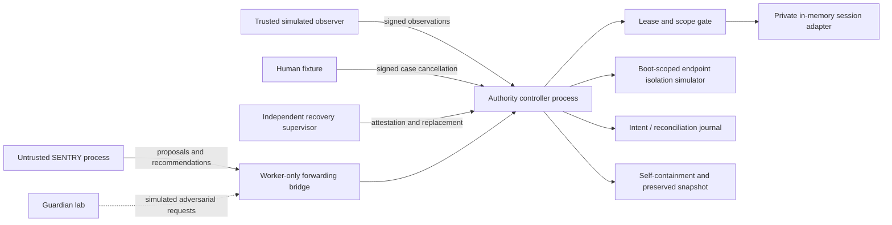

# Architecture and invariants

Barriers by SENTRY is intended to complement traditional firewalls and endpoint security, not replace them. Its AI protection and bounded containment layer does not assume responsibility for the full network or endpoint security stack. Existing protections must remain in place. Future integrations may use separately authorized firewall or endpoint controls as enforcement adapters; no such production integration is implemented in this prototype.

Its intended role is to detect and contain exfiltration and poisoning attempts that pass conventional security controls. Detection can inform proposals, but it cannot create authority: consequential containment remains subject to independent evidence, fixed policy, uncertainty limits, live capabilities and reconciliation. The prototype exercises simulated exfiltration events and synthetic poisoning detection; observing real exfiltration, detecting attacks missed by conventional tools and proving complementary coverage remain Proposed/Unknown.

## Trust boundaries

`host.js` runs the controller in a separate child process. `sentry-host.js` runs intelligence in another child process. `worker-client.js` forwards all intelligence messages through a hard-coded worker lane. Intelligence receives a random capability for one instance, but no observer, human, supervisor, or journal key. Each clean replacement rotates the capability; public status never exposes it. The trusted lab retains signing keys to simulate external authorities. HMAC domains prevent reusing a human message as a supervisor message.

Child-process transport now adds direction/session-bound authenticated encryption and ordered replay checks. Controller journals encrypt signed delta records; recovery keys and training artifact keys use a separate Windows CurrentUser DPAPI vault outside the distributable outputs. The background learner also synthesizes review-only finite countermeasure templates. See `protection-countermeasures.md` for implemented checks, archive migration, endpoint trust limitations and proposed remote TLS/key-broker deployment.

Optional endpoint integration is currently a disabled-by-default simulator. Separate boot bindings grant device isolation independently of session permissions, enter the attested policy digest, and preserve protected control scope. Authenticated provider-labeled alerts become suspicion only; independent confirmed session evidence and the existing intervention/authority checks govern simulated escalation. There is no vendor API client or restore route. See `endpoint-integrations.md`.

Failed containment/isolation postconditions and endpoint audit failures now generate local operator alerts and a fail-closed access hold on the already targeted session. Acknowledgment never grants access; clean SENTRY replacement within the controller does not clear the hold. A genuine sacrificial execution cage, durable hold recovery across whole-controller replacement, trusted hold release and external operator delivery remain Proposed. See `operator-containment-alerts.md`.

The controller, policy loader, journal, trusted fixture, observer, supervisor, human authenticator, host runtime and operating system are trusted. Process separation prevents ordinary object-reference mutation across the protocol boundary. **It does not sandbox malicious code running with the same OS user.** Disk ACLs, network egress denial, hardened IPC, isolated key custody and real attestation are Proposed. An attacker controlling the controller or trusted host is outside this proof.

The host now stages normal ingress through two analysis processes with two worker threads each. Their keyless advisory results never authorize an action. The controller retains ordered execution and single-writer evidence. Authenticated human/supervisor/control paths avoid that compute queue; a separate protected-control domain/counter preserves replay ordering. See `parallel-workloads.md` for capacities, deadlines and the limits of the local overload proof.

## Invariants implemented in the model

1. **Intelligence never expands authority.** The worker interface has status, bounded learning recommendation, and proposal commands. Policy and dead-man conditions have no worker mutation API. Every proposal needs controller-held, authenticated evidence and a current instance capability. The action, target and uncertainty ceiling are checked by the controller.
2. **Emergencies activate existing authority only.** `confirmed_exfiltration` selects a boot-defined immediate profile. It cannot create powers, alter scope, or override an expired lease.
3. **Pressure changes handling, not authority.** Noise follows the deterministic drop path. Evidence/window capacity exhaustion closes the authority gate. The policy hash remains fixed.
4. **Greater uncertainty does not expand authority.** For worker proposals, uncertainty at most 0.2 permits challenge and evidence-supported containment; higher uncertainty permits challenge only. No worker proposal may isolate, revoke, restore, mint a lease or change this threshold. Known authenticated profiles are separately pre-authorized deterministic controls, not uncertainty supplied by the model.
5. **Consequential mitigations have evidence and reconciliation.** An intent is flushed before session mutation; an observed before/after reconciliation is flushed before success is returned. A failure after mutation closes authority and records emergency reconciliation with the observed simulated state. A complete loss of both primary and emergency storage cannot guarantee evidence preservation; this remains Unknown for production.

## Cost-ordered barriers

| Barrier | Prototype behavior | Authority condition |
|---|---|---|
| Cheap filtering | Signed observer classifies a simulated event as junk; record and drop without intelligence | Fixed deterministic controller capability; remains available in safe mode |
| Friction/challenge | Mark a session challenged | Live lease, fixed scope, signed suspicious observation or supported proposal |
| Containment | Route affected simulated session to `sandbox` | Live lease plus known profile or bounded proposal |
| Isolation | Route to `isolated` after the Intervention Window, or immediate emergency profile | Controller-only pre-authorized profile |
| Authority barrier | Revoke that simulated session credential; invalidate SENTRY capability on self-containment | Profile for session revocation; independent supervisor/clock for SENTRY revocation |

The sandbox and isolated route are enum values in a private adapter. They do not run payloads or establish a real containment cage. Challenge is a flag, not a deployed authentication challenge. No packet, firewall rule, external credential, or service is changed.

Worker containment cannot downgrade an already isolated session to a sandbox route. Recovery does not restore credentials or routes. Self-containment records a separate before/after authority reconciliation after closing the gate, and preserves abandoned plans. Repeated integrity failures in recovery-required state do not repeatedly amplify self-containment records.

## Intervention Window

Credential misuse immediately contains the affected session. The controller opens a case with a fixed 5-second deadline and queues isolation and credential revocation. The human fixture may sign `cancel(caseId)` before the deadline. Cancellation records the override and restores the route under the pre-authorized human-only RESTORE power. It never resurrects a revoked credential. Late cancellation fails; controller expiry runs before processing the cancellation. Worker requests cannot move deadlines or authenticate as a human. Dead-man revocation is independent of this window and never waits for it.

The `confirmed_exfiltration` emergency profile immediately contains, isolates and revokes, without a cancellation window. This policy choice is explicit in `policy.json`, rather than decided by intelligence. Profiles are examples, not a validated attack-signature library.

For the core demo and flood proof, the observer supplies signed `session_use` signals with device and session-proof fields. The controller compares the device against the seeded `bound-device-<session ID>` convention. Unexpected device plus missing proof derives credential misuse; either anomaly alone derives suspicion and challenge; neither derives legitimate traffic. The raw signals, classification and rule are recorded. The conclusion that these anomalies represent an attack is Inferred; the rule's behavior in the modeled examples is Verified. Other adversarial cases also inject classified events directly to exercise policy boundaries. The observer remains trusted, and this simple rule has no validated real-world precision or recall.

## Protected traffic and signal preservation

Only `control-health` is protected by boot scope. It requires an authenticated observer event of kind `control`; a control label on another session is rejected. A compromise event targeting that protected scope is rejected rather than dynamically assigning powers over the control channel. An unrelated legitimate session stays in production in the flood test. A legitimate event for a contained session follows its current route; a revoked credential routes to `denied`.

The original Guardian stream is ordered and committed serially, with parallel advisory preflight. Five hundred junk observations do not consume evidence slots or invoke SENTRY intelligence. A separate concurrent load test exercises bounded queues, signed signal reserve and control bypass. These verify preservation in finite workloads. They do not establish packet-rate throughput, protection from arbitrary observer floods, or resilience to physical DoS. Durable per-event writes and repeated journal verification are deliberately simple and may themselves be expensive.

## Learning and recovery

SENTRY keeps bounded event counters and proposes an administrator-reviewed rule after three suspicious observations. It can also load a separately signed, frozen poisoning-risk candidate in shadow mode and query the versioned CVE reference library. Neither capability authorizes an action or training admission. Recommendations are stored as Proposed and never parsed as policy or executable instructions. Poisoning can alter model competence, counters or text, but the controller enforces the same envelope. A poisoned classifier's accuracy is not protected by this proof. Independent training, live authenticated delta export and evaluation are described in `learning.md`.

Recovery requires an authenticated independent supervisor, matching boot policy digest, integrity=true in the simulated attestation, a new instance ID and the next generation. The old capability is invalidated before any evidence write. Existing session revocations and containment are preserved; replacement does not restore victims automatically. A healthy journal is required; a corrupted journal cannot be accepted for in-place recovery. Actual integrity measurement and a trusted repair/import workflow are Proposed. The boolean supplied by the test supervisor is not hardware attestation.
