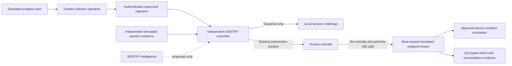

# Endpoint security integrations

SENTRY can complement endpoint security through an independent integration broker. This prototype now implements a **disabled-by-default, local simulated bridge** with normalized alert and response fixtures labeled Microsoft Defender for Endpoint and CrowdStrike Falcon. These labels select scoped simulator bindings; they do not establish a credentialed vendor connection, compatibility certification or actual endpoint protection.

## Implemented local path



`endpoint-policy.json` defaults to `mode: disabled` and an empty binding list. A trusted test launcher can choose a separately reviewed boot file with `mode: simulate`. Each binding names one already-approved session, provider and simulated device, plus an explicit `allowIsolation` grant. At most 16 bindings are allowed. Unknown providers, live mode, extra permission fields, duplicate session/device bindings and isolation grants for protected-control sessions are rejected. The endpoint scope is frozen at construction. When enabled, the controller's attested policy digest covers both its original policy and endpoint scope. No hot expansion route exists.

The trusted collector uses separate per-provider HMAC keys in `endpoint-alert/<provider>` domains. These are internal fixture signatures, not the vendors' native authentication mechanism. The supervisor supplies the signed normalized envelope. Provider identity, strict fields, monotonic sequence, approved device mapping and the controller lease are checked. Alert IDs and device IDs are hashed in alert evidence. Free text, caller-supplied severity, destinations and arbitrary response commands are not accepted.

An endpoint alert with `suspected_exfiltration`, `suspected_poisoning` or `credential_alert` produces **suspicious** evidence and a local session challenge. It does not prove data theft or poisoning, create a confirmed profile, grant machine-level permissions, or trigger host isolation by itself. Protected-control alerts are recorded for human review without issuing a challenge to that channel. Signed telemetry can still be false if its trusted collector is compromised; this is not evidence of detection accuracy.

Independent simulated credential/session misuse can activate the existing containment profile. For that profile, session containment happens immediately; session isolation and credential revocation follow the existing Intervention Window. Only a controller-authorized ISOLATE operation can invoke the simulated endpoint broker, and host isolation also requires the separate boot grant. A session-level power is not sufficient host-level permission. The target comes from the frozen binding, never the learner's proposal. Human cancellation removes pending escalation. Losing authority abandons pending endpoint actions.

The broker writes an endpoint intent before the fake effect, then a reconciliation describing `simulated_applied`. Same-binding/same-case retries are idempotent within controller memory and do not repeat the effect. Responses are bounded to 1,000 stored receipts. An endpoint audit failure closes controller authority and preserves the simulated isolation state; it does not silently restore access. Already isolated devices remain isolated across clean SENTRY instance recovery. The worker cannot call endpoint commands, change scopes, lift containment or receive collector/vendor keys. No endpoint-release API is implemented.

Journal encryption, user-bound key recovery and encrypted child-process transport apply to this path. There is no HTTP client in the endpoint adapter. No real isolation, process termination, file quarantine, remote shell, live response or security-agent disabling is implemented.

## Proposed vendor mappings

| Product | Official response surface | Prototype status |
|---|---|---|
| Microsoft Defender for Endpoint | Machine isolation API; requires `Machine.Isolate` permission | Normalized simulator only; no OAuth or API calls |
| CrowdStrike Falcon | Hosts API containment action; containment allows vendor cloud/policy-approved communication | Normalized simulator only; no OAuth or API calls |

Microsoft documents `POST /api/machines/{id}/isolate` and returns a Machine Action on acceptance. An accepted request is not proof of completed isolation. Real integration must poll/correlate the action and independently reconcile final device state. Supported isolation modes depend on the device platform. See the [official isolation API](https://learn.microsoft.com/en-us/defender-endpoint/api/isolate-machine).

CrowdStrike documents `contain` and `lift_containment` in the [official Hosts API](https://developer.crowdstrike.com/api-reference/collections/hosts/). Only containment is a proposed SENTRY response; restoration must use a separately trusted recovery path. The simulator implements neither vendor's native request, response or event schemas. Native schema validation, asynchronous errors and lifecycle behavior remain to be built and tested.

## Production boundary

Before a live adapter, establish customer-approved device scopes and per-device impact, least-privilege read versus response identities, a credential broker outside intelligence, fixed vendor HTTPS endpoints, certificate/hostname validation, token rotation and revocation, bounded timeouts, rate limits, durable idempotency and replay records, and asynchronous completion/unknown-outcome reconciliation. Existing management, recovery and legitimate/control communications need independent isolation-policy review. A host may run unrelated applications; machine isolation must not inherit an AI session's scope implicitly.

Unknown or timed-out vendor outcomes must be recorded as unknown, not retried blindly or reported as contained. Do not release existing endpoint containment when SENTRY expires or restarts. Real restore/unisolation requires separately authorized trusted recovery. SENTRY remains complementary to the customer's firewall and endpoint security; no integration may disable those products to make SENTRY effective.

Live licensing, tenant permissions, onboarding, provider credentials, protected communications, real device effects, vendor failover and interoperability remain **Proposed/Unknown**. These are production design requirements, not implemented capabilities or a request to connect customer accounts during this local proof.

## Run and claims

```text
node src/endpoint-demo.js
node --test tests/endpoint.test.js
node --test tests/*.test.js
```

The demo creates a boot-scoped simulator file, encrypted evidence and a key-reference sidecar under `runs/endpoints-*`. `endpoint-report.json` records provider labels, gate checks and simulated receipts. Normal Windows user-profile access is needed for the private recovery vault.

- **Verified locally:** disabled defaults, strict immutable host scope, protected-device rejection, collector authentication/replay checks, suspicion-only handling, delayed isolation, human cancellation, independent host grants, encrypted intent/reconciliation, idempotent retries, abandoned pending responses, quarantine/expiry denial and blocked worker restore commands.
- **Recorded:** normalized fixture alerts, fake endpoint state transitions and the local demonstration.
- **Inferred:** published isolation/containment APIs provide potential enforcement surfaces for an independently scoped broker.
- **Proposed:** credentialed vendor adapters, read-only telemetry first, audited production response permissions and trusted recovery.
- **Unknown:** native vendor interoperability, real-world endpoint effects, protected-path availability and incremental security coverage.
