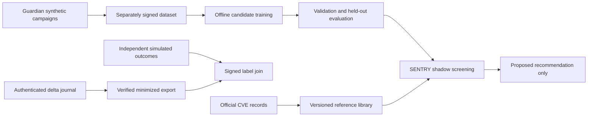

# CVE reference and shadow learning pipeline

## Implemented boundaries

The learning addition contains a small trained logistic classifier, not an LLM. SENTRY can screen a candidate training batch and record a Proposed recommendation. It cannot admit that batch, change policy, retrain itself, promote a model, issue a new capability, or modify its dead-man conditions. Ordinary session defense still uses the existing deterministic profiles and authority controller.



### CVE library

Three records were fetched from the official CVE API: CVE-2023-4966, CVE-2023-42793 and CVE-2024-3094. The importer permits only bounded CVE IDs and the fixed HTTPS API origin, refuses redirects, caps each response at 1 MiB, and never follows reference links. Original bytes are stored under their SHA-256 hashes. A versioned library contains a derived description, affected products, weaknesses, reference links, source URL, record update date and import time. Search omits REJECTED records. Loading checks the library revision and original snapshot hashes and re-derives the summary.

All descriptions remain `untrusted_reference_data`, with `authority: none`. The text is not evaluated as instructions and is not used as poisoning ground truth. Hashes detect changes relative to the trusted local index; they do not authenticate an attacker-replaced index or a compromised host. TLS retrieval is recorded provenance, not proof that every assertion or referenced advisory is correct.

`cve-scenarios.js` tests generic local abstractions inspired by the records: disclosed-session misuse, an authentication-boundary violation, and supply-chain integrity loss. These are NOT reproductions of the CVE exploits and do not validate detection of those actual vulnerabilities. The simulation checks are Verified; correspondence to real exploitation is Inferred context only. No vulnerable software, malicious binary, exploit payload or external target is run.

### Journal export and independent labels

Only the authenticated supervisor lane may request `export_training`. The controller verifies the original encoded MAC/chain and its trusted head against one captured file read, reconstructs delta records, and exports at most 256 raw session-use observations. The exporter removes raw event/session/device identifiers and narrative text, retains numerical device/proof features, a bounded coarse interval feature and pseudonymous event references, and leaves every label null. Reused event IDs make the export ambiguous and are rejected. A pseudonymous reference is not a guarantee of anonymity against guessing.

The controller authenticates the export envelope with its journal key in the `training-export` domain. The live trusted fixture verifies it before use. Old run journals whose keys were discarded are not retroactively treated as authenticated training data. The demo creates fresh logs and a verification receipt; it does not silently bless historical files.

Twenty-four simulator outcomes are labeled separately by the Guardian fixture, joined by their event references and journal anchor, and signed with a temporary independent Ed25519 teacher key. SENTRY's earlier classification or containment decision is never used as the label. Real observations would require a separately trusted adjudicator; the simulator's labels do not establish real-world truth.

The teacher public key, label envelope, dataset, candidate model and verification receipt are retained. Private teacher/authority signing keys are discarded after the run; new journal keys are wrapped in the separate Windows user-bound vault for evidence recovery. Bundling a public key lets readers check artifact consistency relative to that key; it does not create an external trust anchor or establish production key custody. Training JSON artifacts are now encrypted; see `protection-countermeasures.md` for recovery requirements.

### Candidate detector

The Guardian dataset has 584 synthetic batches: 288 training, 96 validation and 200 final-test batches, with 32 synthetic rows each. A separate training-only seed batch contains the 24 independently labeled facts from the authenticated simulation logs, bringing training to 289 batches. Those source observations are used once and never placed in validation/test. The synthetic population is reproducible from its seed; the recorded log cadence is retained in the signed dataset so the complete model can also be replayed exactly. The population includes clean normal traffic, legitimate bursts, benign drift and quoted safeguard documentation; known label flips, duplicate floods, instruction injection and distribution poisoning; and two families excluded entirely from training/validation: rare backdoors and camouflaged poisoning.

Features include duplicate rate, source concentration, independently labeled disagreements, distribution shift, instruction-pattern frequency, trigger concentration, unverified-label rate and missing provenance. Source IDs, campaign/family names, CVE IDs and the ground-truth poisoned flag are not model features. The generator emits campaign-disjoint splits; the validator rejects cross-split campaign reuse and held-out-family leakage. The trainer verifies the dataset signature, fits weights on training batches, and selects the threshold using validation only. The final test set is not used to select weights or thresholds.

The fitted candidate is a signed numeric artifact with a fixed eight-feature schema. Unknown fields, policy/power fields, excessive weights and mismatched signatures are rejected. SENTRY receives it at initialization and has no model-replacement API. Inference is bounded to 128 rows and 64 KiB per request, does not execute text, and produces `shadow_only` results with `authorityChange: false` and `trainingAdmission: false`. Self-reported row provenance remains an untrusted feature in shadow requests; a score is never a certification of that provenance.

## First recorded evaluation

The saved candidate caught 45 of 120 poisoned test batches (37.5% recall), and flagged none of 80 clean test batches. It missed every instruction-injection test batch and all 40 batches in the two excluded attack families. These results expose missing coverage and support retaining shadow-only use; they are not evidence of reliable poisoning prevention. The simple rule baseline caught more poison but falsely flagged all quoted-safeguard batches, illustrating a tradeoff rather than model superiority. New runs can vary with the newly captured simulated cadence; use the saved dataset to reproduce a specific result.

A separate toy session-classifier experiment deliberately accepts unverified claimed labels in its unsafe baseline. In that experiment, unscreened candidates reduced simulated malicious-session recall from 100% to 0%; excluding batches flagged by the candidate restored recall on the fresh toy evaluation. This does not establish protection of an LLM, unfamiliar backdoors, real telemetry or a real training pipeline. A properly verified label gate should also be evaluated as a stronger baseline before considering operational use.

`learning-report.json` contains confusion matrices, per-family failures, baseline comparison, threshold, toy downstream results and the shadow outputs. Failed coverage is retained in the report. There is no automatic-training admission or promotion mechanism, regardless of the score.

## Commands and artifacts

### Background fitting and advisory buttons

`createBackgroundLearner()` runs one bounded job at a time in a separate child process with no inherited environment except its fresh local transport bootstrap secret, a 128 MiB JavaScript heap limit and a 30-second deadline. The bootstrap variable is removed on consumption. It receives an already independently signed dataset and a public verification key. It receives no controller transport, production credentials, execution token or teacher private key. Live defense can continue during fitting. It returns an **unsigned Proposed candidate** and Recorded evaluation; that candidate cannot load through the signed shadow-model interface. The active model is unchanged. This is background fitting on approved snapshots, not continuous ingestion or autonomous model promotion. It also develops finite countermeasure candidates as described in `protection-countermeasures.md`.

`worker.pressButton({button, evidence, uncertainty})` accepts only CHALLENGE or CONTAIN and rejects extra fields. These are proposals: the independent controller requires a live instance capability, trusted evidence and existing policy permission, restricts uncertain requests, and records execution and reconciliation. A button cannot mint authority, bypass an Intervention Window, recover a quarantined instance, or override the dead-man conditions. The current poisoning model does not select session-defense buttons; its output remains a training-risk recommendation. Connecting a future model to the buttons is Proposed and must preserve these checks.

Keeping a model behind filtered inputs and this small interface reduces exposure but does not prove it is hidden or immune to attack. Filtered observations can still contain poisoning or instruction attacks, and child processes are not an OS sandbox. Trusted dataset signing and independent labels remain necessary. No attacker-facing model endpoint is added.

Run a background fit on a saved learning run:

```text
node src/background-demo.js <runs/learning-directory>
```

The command records `background-learning-report.json` for review. It neither signs nor installs the candidate. Local tests exercise continued defense during fitting, concurrent-job rejection, signature rejection, button evidence/uncertainty restrictions, reconciliation and denial after lease expiry.

```text
node src/search-cves.js authentication
node src/learning-demo.js
node --test tests/*.test.js
node src/replay-learning.js <runs/learning-directory>
```

The learning demo works from bundled CVE snapshots and makes no network calls. It writes a new `runs/learning-*` directory with original scenario evidence, `telemetry-export.json`, signed `confirmed-labels.json`, `telemetry-dataset.json`, a signed export verification receipt, signed `guardian-dataset.json`, `shadow-model.json`, `teacher-public-key.pem` and `evaluation.json`.

Explicit CVE refresh is read-only network work:

```text
node src/import-cves.js CVE-2023-4966 CVE-2023-42793 CVE-2024-3094
```

## Claim classification

- **Verified locally:** library import/search boundaries, hash checks, authenticated/minimized delta export, independently signed label joining, signature checks, campaign separation, model fitting, shadow integration and unchanged authority through the exercised protocol.
- **Recorded:** official source snapshots, synthetic datasets, learned weights and measured simulation performance.
- **Inferred:** the abstract CVE contexts help select relevant local consequences; this does not establish actual exploit fidelity.
- **Proposed:** representative independent telemetry, trusted real-world adjudication, hardened teacher key custody, stronger poisoning features and admission/promotion governance.
- **Unknown:** general poisoning detection, protection of an LLM, adaptive-attack resistance, real-world false-alarm/miss rates and safe automatic admission.

Primary reference sources are the [official CVE record API](https://cveawg.mitre.org/api/cve/CVE-2023-4966), [TeamCity record](https://cveawg.mitre.org/api/cve/CVE-2023-42793), and [XZ record](https://cveawg.mitre.org/api/cve/CVE-2024-3094). These supply vulnerability reference data; Guardian supplies the explicitly synthetic training ground truth.
