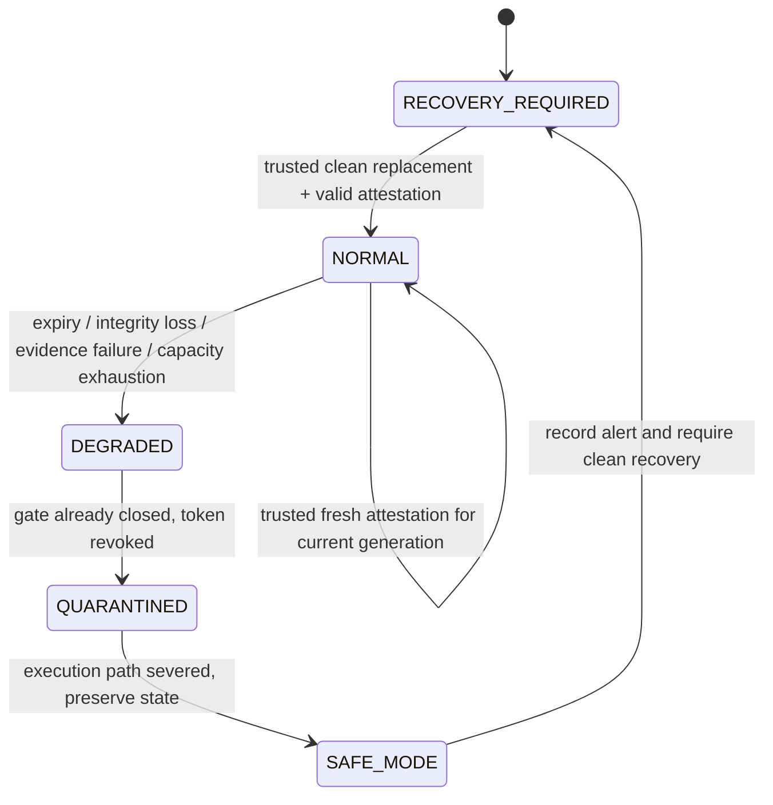

# State machine

The machine is separate from session barrier progression. Boot starts in `RECOVERY_REQUIRED` with no execution capability. Every worker proposal and consequential leased adapter operation checks the current deadline. The controller also checks expiry and journal integrity on a 100 ms timer, without worker heartbeat traffic.

The failure transitions execute synchronously in one controller turn. They are recorded milestones, not extended periods with retained privileged access. At the first failure, deadline becomes zero, the worker capability is erased, pending consequential plans are cleared, and the execution gate is severed. Even if evidence I/O then fails, the gate remains closed. Safe-mode deterministic junk dropping and authenticated control admission continue. Recommendations and public status remain possible; consequential proposals fail.

| Input | Required independent proof | Result |
|---|---|---|
| Initial activation | Signed supervisor, generation 1, new identity, matching digest, healthy journal | NORMAL with finite lease and capability |
| Renewal | Signed fresh supervisor sequence, same identity/generation, integrity, digest | Renew lease; no new powers |
| Worker heartbeat | None accepted | Denied; no lease renewal |
| Forged/replayed attestation | Authentication fails or stale sequence | Denied; existing lease continues to its deadline |
| Validly authenticated bad integrity/digest | Independent supervisor report | Immediate self-containment |
| Expiry | Controller monotonic clock | Immediate gate revocation; synchronous milestones |
| Recovery from failure | Signed supervisor, new identity, next generation, matching digest and healthy journal | New capability; old capability remains invalid |
| Journal corruption | HMAC/chain/truncation verification | Self-containment; in-place recovery denied |

There is no worker-controlled clock. The trusted simulator can only advance time by a nonnegative bounded amount; advancing cannot extend a lease. Wall-clock progression uses Node's monotonic performance clock. If the process is stopped, no adapter operation can execute; checks precede execution after resumption. This does not prove independent external actuator revocation while the trusted host is unavailable. Durable lease enforcement in remote actuators is Proposed.

Machine-readable transitions are in `schemas/state-machine.json`. Policy validity is enforced at boot by `validatePolicy`; the JSON schema documents the same main constraints. Authenticated lane payloads are exact-field checked at runtime, and signed sequences must strictly increase per lane. Sequences and controller state are not restored after host restart; startup requires a fresh journal, fresh fixture keys and a clean generation. Production restart persistence and rollback protection are Unknown.
